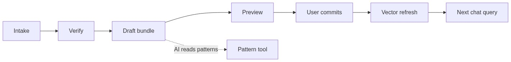

# Zenith

Local cheque and invoice management for Sri Lankan SMBs: invoice photos in (web or WhatsApp) → human verify → AI-assisted cheque bundling → cash-flow timing → print.

**Problem.** Many businesses still pay suppliers with cheques. Invoices arrive as photos, amounts and due dates get retyped, several invoices are grouped under an LKR ceiling, and cash must sit in the bank before the cheque is presented — including CBSL holidays.

**Solution.** Zenith keeps that loop in one Flask + SQLite app, with a human in the loop before any invoice is accepted, and Python guardrails after the AI proposes bundles.


## Features

- **Login** — single-user password gate (`APP_PASSWORD`)
- **Invoice upload** — Gemini vision extraction, then human verification
- **WhatsApp inbox** — Meta Cloud API photos, whitelist, manual **Send to AI**
- **Cheque bundling** — LKR ceiling grouping, drag-and-drop, chat assistant
- **Guardrails** — CBSL holidays and amount ceiling in Python (`core/guardrails.py`)
- **Cash flow** — when money must be in the bank
- **Cheque print** — formatted cheque output
- **Analytics** — reports after cheque commits
- **Languages** — English, Sinhala, Tamil

## AI agents

| Agent | Role |
|-------|------|
| **1 Vision** | Invoice document check + OCR (Gemini) |
| **2 Anomaly** | Pre-verify rules and findings before the human accepts the invoice |
| **3 Strategist** | Cheque plan via Gemini tool-calling over bundling + dates |
| **4 Reviewer** | Plain-language explanation of the plan (Gemini) |

**Not an LLM:** holiday and ceiling checks run in Python after Agent 3. If AI is off or fails, fallback bundling is `core/bundling.py` (`compute_bundles`).

Optional extra: `agentic/` orchestrator (`USE_AGENTIC_ORCHESTRATOR`). Standard web + WhatsApp inbox paths do not depend on it.

## Architecture

Intake → verify → draft bundle → preview → commit. Patterns can feed the bundling assistant.




Full walkthrough: [docs/WORKFLOW.md](docs/WORKFLOW.md). Schema: [database/DATABASE.md](database/DATABASE.md).

## Tech stack

| Layer | Choice |
|-------|--------|
| App | Python 3.11+, Flask |
| Data | SQLite |
| OCR / strategist / reviewer | Google Gemini |
| Bundling chat + analyst | OpenAI (optional) |
| Tool-calling | LangChain |
| WhatsApp | Meta Cloud API (Twilio / Node bridge optional) |
| Print | ReportLab |
| Vector patterns (optional) | ChromaDB |

## Prerequisites

- Python **3.11+**
- `pip`
- (Optional) Gemini and/or OpenAI API keys
- (Optional) Meta WhatsApp app + a public HTTPS URL (e.g. cloudflared) for live intake

## Quick start (judges / local demo)

No paid APIs required.

```bash
pip install -r requirements.txt
copy .env.example .env
```

On Linux/macOS use `cp .env.example .env`.

In `.env` set at least:

```env
APP_PASSWORD=demo
USE_FAKE_AI=true
```

Then:

```bash
python scripts/init_db.py
python scripts/seed_sample_invoices.py
python app.py
```

Open http://127.0.0.1:5000 and sign in with `APP_PASSWORD`.

## Live hosted link (Idealize web apps)

Zenith is a **Python Flask** app with SQLite, file uploads, and optional WhatsApp webhooks. **Netlify and Vercel cannot run it** (those hosts are for static / Node frontends).

Use a Python host and submit that HTTPS URL:

1. Push this repo to GitHub (do not commit `.env` or `dont upload/`).
2. Create a web service on [Render](https://render.com) (Blueprint: `render.yaml`) or Railway / Fly.io / any VPS with the `Dockerfile`.
3. Set environment variables (dashboard, not the repo):

   | Variable | Value |
   |----------|--------|
   | `FLASK_ENV` | `production` |
   | `HOST` | `0.0.0.0` |
   | `FLASK_SECRET_KEY` | a long random string |
   | `APP_PASSWORD` | the login you give judges |
   | `USE_FAKE_AI` | `true` for a no-key demo, or `false` plus `GEMINI_API_KEY` |

4. First boot creates the SQLite database and sample invoices if the DB file is missing.
5. Open `https://YOUR-SERVICE.onrender.com` — you should see login. Health check: `/health`.

### Keep SQLite + photos across redeploys (important)

Render’s **free** filesystem is wiped on every redeploy/restart — that leaves broken rows with missing invoice photos. To keep data with SQLite:

1. Use a **paid** web service (Starter or higher) — persistent disks are not available on Free.
2. Attach a disk mounted at `/var/data` (Blueprint `render.yaml` already does this).
3. Set these env vars (also in `render.yaml`):

   | Variable | Value |
   |----------|--------|
   | `DATABASE_PATH` | `/var/data/invoice_cheque.db` |
   | `UPLOAD_FOLDER` | `/var/data/invoices` |
   | `INBOUND_QUEUE_DIR` | `/var/data/inbound_queue` |
   | `CHROMA_PERSIST_DIR` | `/var/data/chroma` |

4. Set `APP_PASSWORD` yourself in the Render dashboard (do not leave it auto-generated if you care about a stable login).
5. Redeploy. Startup logs should show `db=/var/data/invoice_cheque.db` and `uploads=/var/data/invoices`.

If you are already on Free: upgrade the service → add Disk → set the env vars above → redeploy. Data lost on previous Free redeploys cannot be recovered.

Local `python app.py` is unchanged (`HOST=127.0.0.1` in `.env`).

## Setup with live AI

Same as quick start, then in `.env`:

- `USE_FAKE_AI=false`
- `GEMINI_API_KEY` — document check + OCR (Agent 1) and Agents 3–4
- `OPENAI_API_KEY` — bundling chat assistant and analyst (optional)

See [.env.example](.env.example) for every variable.

## Run

```bash
python app.py
```

## WhatsApp invoice intake (Meta Cloud API)

Optional. The web upload path works without WhatsApp.

1. Set `META_WHATSAPP_TOKEN`, `META_PHONE_NUMBER_ID`, `META_VERIFY_TOKEN` in `.env`.
2. Tunnel Flask:

   ```bash
   cloudflared tunnel --url http://127.0.0.1:5000
   ```

3. In Meta Developer Console → WhatsApp → Configuration, set the webhook to `https://YOUR-TUNNEL/webhook/whatsapp` with the same verify token. Subscribe to `messages`.
4. In the app: **Invoices → WhatsApp settings** — whitelist supplier numbers.
5. Suppliers send invoice photos → they land in **WhatsApp photos** → **Send to AI** → human verify.

**Local mock (no Meta):** `USE_WHATSAPP_MOCK=true` and `MOCK_IMAGE_PATH=path/to/test.jpg`, then `python whatsapp_agent.py`.

**Optional Node bridge:** [whatsapp-bridge/README.md](whatsapp-bridge/README.md) — not required for Meta production.

## Database

SQLite file: `database/invoice_cheque.db` (gitignored). Rebuild with `python scripts/init_db.py`.

## Tests

```bash
pip install pytest
python -m pytest agentic/tests core/tests agents/tests routes/tests -q
```

## Team

| Name | GitHub |
|------|--------|
| Sithil Yapa | [sithilyapa717](https://github.com/sithilyapa717) |
| Yohan Ruchitha | [yohanruchitha2-star](https://github.com/yohanruchitha2-star) |
| Nithika Senanayake | [senanayakenithikas-ux](https://github.com/senanayakenithikas-ux) |
| Vinudi Sanaya | [VinudiSanaya](https://github.com/VinudiSanaya) |
| Chamodi Madurasinghe | [ChamodiMadurasinghe](https://github.com/ChamodiMadurasinghe) |


## License

This project is licensed under the [MIT License](LICENSE).
