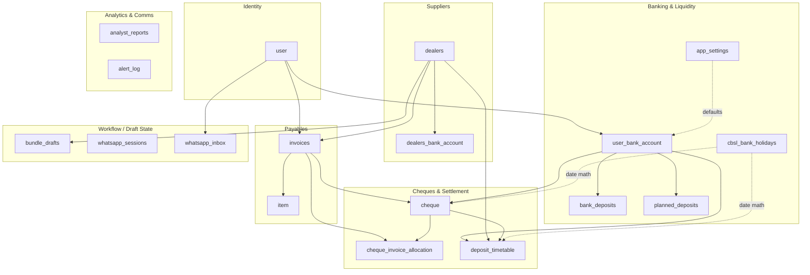
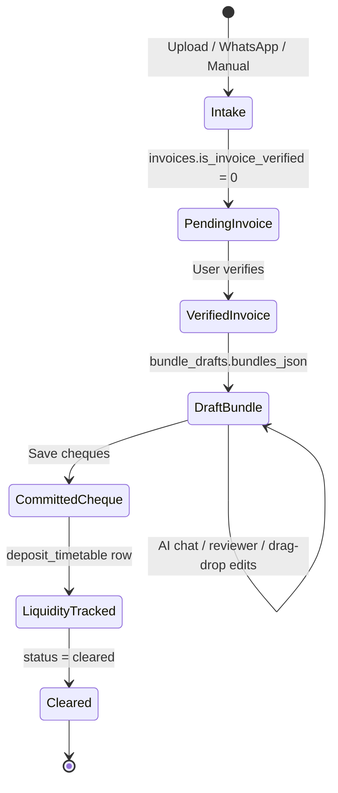
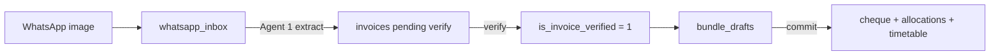

# Zenith Database Reference

SQLite file: `database/invoice_cheque.db`  
Schema source: `database/schema.sql`  
Rebuild: `python scripts/init_db.py` (reads `APP_PASSWORD` from `.env`)  
Migrate existing DB: `python scripts/init_db.py --migrate`

**Vector pattern index (derived):** Committed cheque history is also indexed into a local ChromaDB store at `database/chroma/` for the Bundling Assistant's read-only recommendation tool. SQLite remains the source of truth; refresh via cheque commit or `python scripts/backfill_dealer_patterns.py`.

**Full guide:** [Vector_Pattern_Engine.md](../docs/Vector_Pattern_Engine.md). Architecture diagrams: [docs/diagrams/vector/](../docs/diagrams/vector/).

---

## High-level domain map



---

## Entity-relationship diagram

```mermaid
erDiagram
    user {
        int user_id PK
        text user_name UK
        text email UK
        text password_hash
    }

    user_bank_account {
        int user_bank_acc_id PK
        int user_id FK
        text account_name
        text nickname
        real available_balance
        real overdraft_limit
        text branch_name
        text bank_name
    }

    dealers {
        int dealer_id PK
        text dealer_name
        text dealer_email
        text dealer_telno
        text dealer_address
        text dealer_strictness
        int casual_days
        text impossible_days
        int preferred_dealer_bank_acc_id FK
        int default_user_bank_acc_id FK
    }

    dealers_bank_account {
        int dealer_bank_acc_id PK
        int dealer_id FK
        text account_name
        text branch_name
        text bank_name
    }

    invoices {
        int invoices_id PK
        int user_id FK
        int dealer_id FK
        int cheque_id FK
        text invoice_no
        text invoiced_date
        text delivery_date
        int credit_period_days
        real total_amount
        text location_path
        text pending_dealer_json
        int is_invoice_verified
    }

    item {
        int item_id PK
        int invoices_id FK
        text item_code
        text item_name
        int item_qty
        real item_price
        real item_discount
        real item_mrp
        real item_line_total
    }

    cheque {
        int cheque_id PK
        int user_bank_acc_id FK
        text cheque_no
        text cheque_date
        text amount_in_words
        real amount_in_numerals
        int verification_status
        text predicted_clearance_date
        text cheque_print_date
    }

    cheque_invoice_allocation {
        int allocation_id PK
        int cheque_id FK
        int invoices_id FK
        real amount
        int part_index
        int part_count
    }

    deposit_timetable {
        int timetable_id PK
        int user_bank_acc_id FK
        int cheque_id FK
        int dealer_id FK
        text stated_date
        text true_settlement_date
        text target_funding_date
        real total_amount
        int days_gained
        text status
    }

    bundle_drafts {
        int dealer_id PK_FK
        real ceiling_lkr
        text bundles_json
        text validation_issues_json
        int allow_exceed_ceiling
        text chat_history_json
        text updated_at
    }

    bank_deposits {
        int deposit_id PK
        int user_bank_acc_id FK
        text deposit_date
        real amount
        text reference
    }

    planned_deposits {
        int planned_deposit_id PK
        int user_bank_acc_id FK
        text planned_date
        real amount
        text notes
        text status
    }

    cbsl_bank_holidays {
        text holiday_date PK
        text description
    }

    app_settings {
        text setting_key PK
        text setting_value
    }

    analyst_reports {
        int report_id PK
        text generated_at
        text report_markdown
    }

    whatsapp_sessions {
        text phone PK
        text state
        text context_json
        text updated_at
    }

    whatsapp_inbox {
        int inbox_id PK
        int user_id FK
        text sender_phone
        text location_path
        text received_at
        text status
        int invoice_id FK
    }

    alert_log {
        int alert_id PK
        text channel
        text recipient
        text message
        text sent_at
    }

    user ||--o{ user_bank_account : owns
    user ||--o{ invoices : creates
    user ||--o{ whatsapp_inbox : receives

    dealers ||--o{ dealers_bank_account : has
    dealers ||--o{ invoices : supplies
    dealers ||--o| bundle_drafts : has_draft
    dealers ||--o{ deposit_timetable : linked_via_cheque

    dealers }o--|| dealers_bank_account : preferred_dealer_bank_acc_id
    dealers }o--o| user_bank_account : default_user_bank_acc_id

    invoices ||--o{ item : contains
    invoices }o--o| cheque : primary_link
    invoices ||--o{ cheque_invoice_allocation : split_across

    cheque ||--o{ cheque_invoice_allocation : funds
    cheque ||--o| deposit_timetable : liquidity_row
    cheque }o--|| user_bank_account : drawn_from

    user_bank_account ||--o{ bank_deposits : actual
    user_bank_account ||--o{ planned_deposits : forecast
    user_bank_account ||--o{ deposit_timetable : funding_account

    whatsapp_inbox }o--o| invoices : extracted_to
```

---

## Business lifecycle



---

## WhatsApp intake pipeline



---

## Relationship summary

| From | To | Cardinality | Meaning |
|------|----|-------------|---------|
| `user` | `user_bank_account` | 1:N | Merchant owns bank accounts |
| `user` | `invoices` | 1:N | Merchant owns invoices |
| `dealers` | `invoices` | 1:N | Supplier has many invoices |
| `invoices` | `item` | 1:N | Invoice has line items |
| `invoices` | `cheque` | N:1 (nullable) | Many invoices on one cheque |
| `invoices` | `cheque` via `cheque_invoice_allocation` | N:M | Invoice can split across cheques |
| `cheque` | `user_bank_account` | N:1 | Cheque drawn from one account |
| `cheque` | `deposit_timetable` | 1:1-ish | Liquidity tracking per cheque |
| `dealers` | `bundle_drafts` | 1:1 | One active bundling session per supplier |
| `whatsapp_inbox` | `invoices` | N:1 | Image becomes an invoice |
| `cbsl_bank_holidays` | (none) | — | Reference data for date calculations |
| `app_settings` | (none) | — | Global config key/value store |

---

## Conceptual centers of gravity

The database revolves around three hubs:

1. **`invoices`** — what you owe
2. **`cheque` + `cheque_invoice_allocation`** — how you pay
3. **`user_bank_account` + `deposit_timetable`** — whether you can afford to pay

Everything else (`dealers`, `bundle_drafts`, WhatsApp tables, holidays, settings) supports the path from **received bill → optimized cheque plan → funded payment**.

---

## Domain: Identity

### `user`

Single merchant account used for login.

| Column | Type | Notes |
|--------|------|-------|
| user_id | INTEGER PK | |
| user_name | TEXT UNIQUE | Merchant display name |
| email | TEXT UNIQUE | Contact email |
| password_hash | TEXT | Werkzeug hash (set by `init_db.py` from `APP_PASSWORD`) |

---

## Domain: Banking & Liquidity

### `user_bank_account`

Your bank accounts.

| Column | Type | Notes |
|--------|------|-------|
| user_bank_acc_id | INTEGER PK | |
| user_id | INTEGER FK → user | |
| account_name | TEXT | Legal account name |
| nickname | TEXT | Short label for UI |
| available_balance | REAL | Current ledger balance (updated via Cash Flow UI) |
| overdraft_limit | REAL | Cheque overdraft facility (0 = none). Usable funds = balance + overdraft |
| branch_name | TEXT | |
| bank_name | TEXT | |

### `bank_deposits`

Historical actual deposits into an account.

| Column | Type | Notes |
|--------|------|-------|
| deposit_id | INTEGER PK | |
| user_bank_acc_id | INTEGER FK → user_bank_account | |
| deposit_date | TEXT | YYYY-MM-DD |
| amount | REAL | LKR |
| reference | TEXT | Optional note |

### `planned_deposits`

Future expected deposits (cash-flow forecasting).

| Column | Type | Notes |
|--------|------|-------|
| planned_deposit_id | INTEGER PK | |
| user_bank_acc_id | INTEGER FK → user_bank_account | |
| planned_date | TEXT | Target deposit-by date |
| amount | REAL | LKR |
| notes | TEXT | |
| status | TEXT | `planned` or `done` |

### `app_settings`

Key-value app configuration.

| Key | Default | Purpose |
|-----|---------|---------|
| min_cash_buffer_lkr | 500000 | Minimum safe balance |
| default_bank_acc_id | 1 | Default account for Cash Flow / bundling |

### `cbsl_bank_holidays`

Sri Lanka bank holidays for guardrails and date calculations. Includes every **Saturday and Sunday** plus named CBSL public/bank holidays.

| Column | Type | Notes |
|--------|------|-------|
| holiday_date | TEXT PK | YYYY-MM-DD |
| description | TEXT | CBSL holiday name, or `Saturday` / `Sunday` |

**Populate / refresh** from the official CBSL pages (defaults 2025–2027):

```bash
pip install -r requirements.txt
python scripts/sync_cbsl_holidays.py
python scripts/sync_cbsl_holidays.py --dry-run
python scripts/sync_cbsl_holidays.py --years 2025,2026,2027
```

`scripts/init_db.py` runs the sync automatically after a fresh database create (best-effort if CBSL is unreachable).

Source: [CBSL bank holidays](https://www.cbsl.gov.lk/en/about/about-the-bank/bank-holidays)

---

## Domain: Suppliers

### `dealers`

Supplier registry.

| Column | Type | Notes |
|--------|------|-------|
| dealer_id | INTEGER PK | |
| dealer_name | TEXT | Matched during invoice ingestion |
| dealer_email | TEXT | |
| dealer_telno | TEXT | |
| dealer_address | TEXT | |
| dealer_strictness | TEXT | High / Medium / Low |
| casual_days | INTEGER | Extra days before cheque date |
| impossible_days | TEXT | Comma-separated weekdays (e.g. `Sunday`) |
| preferred_dealer_bank_acc_id | INTEGER FK → dealers_bank_account | Preferred supplier bank for interbank clearing (+1 day) |
| default_user_bank_acc_id | INTEGER FK → user_bank_account | Which of your accounts pays this supplier by default |

Special row: **"Pending Supplier"** — placeholder for invoices from unknown/new suppliers during WhatsApp intake.

### `dealers_bank_account`

Supplier bank details (reference only).

| Column | Type | Notes |
|--------|------|-------|
| dealer_bank_acc_id | INTEGER PK | |
| dealer_id | INTEGER FK → dealers | |
| account_name | TEXT | |
| branch_name | TEXT | |
| bank_name | TEXT | |

---

## Domain: Payables

### `invoices`

Invoice headers — core payable documents.

| Column | Type | Notes |
|--------|------|-------|
| invoices_id | INTEGER PK | |
| user_id | INTEGER FK → user | |
| dealer_id | INTEGER FK → dealers | |
| cheque_id | INTEGER FK → cheque | NULL until bundled / committed |
| invoice_no | TEXT | Unique per `(user_id, dealer_id)` |
| invoiced_date | TEXT | YYYY-MM-DD |
| delivery_date | TEXT | Goods received date (aging) |
| credit_period_days | INTEGER | Due = invoiced_date + days |
| total_amount | REAL | LKR |
| location_path | TEXT | Path to scanned image |
| pending_dealer_json | TEXT | Temp supplier setup / WhatsApp metadata |
| is_invoice_verified | INTEGER | 0 = pending review, 1 = verified |

**Unique constraint:** `idx_invoices_user_dealer_invoice_no` on `(user_id, dealer_id, invoice_no)` — same invoice number can exist for different suppliers, but not twice for the same supplier.

### `item`

Invoice line items.

| Column | Type | Notes |
|--------|------|-------|
| item_id | INTEGER PK | |
| invoices_id | INTEGER FK → invoices | |
| item_code | TEXT | |
| item_name | TEXT | |
| item_qty | INTEGER | |
| item_price | REAL | Single / unit selling price |
| item_discount | REAL | Percent off unit price, default 0 |
| item_mrp | REAL | Printed MRP / list price, default 0 |
| item_line_total | REAL | Line total after discount, default 0 |

---

## Domain: Cheques & Settlement

### Cheque–invoice linking (two mechanisms)

**A. Simple link — `invoices.cheque_id`**  
One invoice → one primary cheque (classic bundling).

**B. Split link — `cheque_invoice_allocation`**  
One invoice can fund **multiple cheques** (or partial amounts across cheques). Committed cheques use both: `cheque_id` on the invoice plus allocation rows for splits. Repository code syncs missing allocation rows on init.

### `cheque`

Issued cheques.

| Column | Type | Notes |
|--------|------|-------|
| cheque_id | INTEGER PK | |
| user_bank_acc_id | INTEGER FK → user_bank_account | Account debited |
| cheque_no | TEXT | |
| cheque_date | TEXT | YYYY-MM-DD |
| amount_in_words | TEXT | |
| amount_in_numerals | REAL | |
| verification_status | INTEGER | 0 = draft, 1 = committed |
| predicted_clearance_date | TEXT | Used by cash-flow projection |
| cheque_print_date | TEXT | Timestamp |

### `cheque_invoice_allocation`

Split funding: one invoice may fund multiple cheques via amount parts.

| Column | Type | Notes |
|--------|------|-------|
| allocation_id | INTEGER PK | |
| cheque_id | INTEGER FK → cheque | |
| invoices_id | INTEGER FK → invoices | |
| amount | REAL | Portion of invoice on this cheque |
| part_index | INTEGER | e.g. part 1 of 3 (default 1) |
| part_count | INTEGER | Total parts (default 1) |

### `deposit_timetable`

Max-liquidity funding schedule for pending cheque outflows. Bridges **cheque planning** → **daily cash-flow view**.

| Column | Type | Notes |
|--------|------|-------|
| timetable_id | INTEGER PK | |
| user_bank_acc_id | INTEGER FK → user_bank_account | Merchant account debited |
| cheque_id | INTEGER FK → cheque | NULL until committed |
| dealer_id | INTEGER FK → dealers | For interbank detection |
| stated_date | TEXT | Cheque stated date |
| true_settlement_date | TEXT | Forward-rolled CBSL business day |
| target_funding_date | TEXT | Latest legal fund-by date |
| total_amount | REAL | LKR outflow |
| days_gained | INTEGER | Holiday/weekend lag days |
| status | TEXT | `pending` \| `cleared` |

---

## Domain: Cheque Bundling Workspace

### `bundle_drafts`

Per-dealer working session (1 row per dealer). **Not** committed payment data — when user saves cheques, data flows into `cheque`, `invoices.cheque_id`, `cheque_invoice_allocation`, and `deposit_timetable`.

| Column | Type | Notes |
|--------|------|-------|
| dealer_id | INTEGER PK FK → dealers | |
| ceiling_lkr | REAL | Max cheque amount limit |
| bundles_json | TEXT | Proposed cheque groups (persisted in-memory structure) |
| validation_issues_json | TEXT | Guardrail warnings |
| allow_exceed_ceiling | INTEGER | 0/1 flag |
| chat_history_json | TEXT | AI assistant + reviewer chat |
| updated_at | TEXT | Last update timestamp |

---

## Domain: WhatsApp Intake

### `whatsapp_sessions`

Conversation state machine per phone number.

| Column | Type | Notes |
|--------|------|-------|
| phone | TEXT PK | Sender phone |
| state | TEXT | Current conversation state |
| context_json | TEXT | Session context payload |
| updated_at | TEXT | Last activity |

### `whatsapp_inbox`

Incoming invoice images before extraction.

| Column | Type | Notes |
|--------|------|-------|
| inbox_id | INTEGER PK | |
| user_id | INTEGER FK → user | |
| sender_phone | TEXT | |
| location_path | TEXT | Stored image path |
| received_at | TEXT | Timestamp; often used as `delivery_date` on invoice |
| status | TEXT | `pending` → `extracted` |
| invoice_id | INTEGER FK → invoices | Set after Agent 1 extraction |

---

## Domain: Analytics & Notifications

### `analyst_reports`

Cached Agent 3 markdown reports.

| Column | Type | Notes |
|--------|------|-------|
| report_id | INTEGER PK | |
| generated_at | TEXT | Timestamp |
| report_markdown | TEXT | Full markdown report |

### `alert_log`

Outbound alerts audit trail (WhatsApp, email, etc.).

| Column | Type | Notes |
|--------|------|-------|
| alert_id | INTEGER PK | |
| channel | TEXT | e.g. whatsapp, email |
| recipient | TEXT | |
| message | TEXT | |
| sent_at | TEXT | Timestamp |

---

## Standalone tables (no foreign keys)

| Table | Why standalone |
|-------|----------------|
| `cbsl_bank_holidays` | Public reference calendar |
| `app_settings` | Key/value config |
| `analyst_reports` | Generated report archive |
| `alert_log` | Notification audit log |
| `whatsapp_sessions` | External phone-keyed session store |

---

## Indexes

| Index | Table | Purpose |
|-------|-------|---------|
| idx_user_bank_account_user_id | user_bank_account | Lookup accounts by user |
| idx_cheque_user_bank_acc_id | cheque | Cheques by account |
| idx_cheque_predicted_clearance | cheque | Cash-flow date queries |
| idx_invoices_user_id | invoices | Invoices by user |
| idx_invoices_dealer_id | invoices | Invoices by supplier |
| idx_invoices_cheque_id | invoices | Invoices by cheque |
| idx_invoices_invoice_no | invoices | Invoice number lookup |
| idx_invoices_user_dealer_invoice_no | invoices | **Unique** invoice number per supplier |
| idx_item_invoices_id | item | Line items by invoice |
| idx_item_item_code | item | Product code lookup |
| idx_dealers_bank_account_dealer_id | dealers_bank_account | Supplier bank accounts |
| idx_cheque_cheque_no | cheque | Cheque number lookup |
| idx_dealers_dealer_name | dealers | Supplier name search |
| idx_cheque_alloc_cheque | cheque_invoice_allocation | Allocations by cheque |
| idx_cheque_alloc_invoice | cheque_invoice_allocation | Allocations by invoice |
| idx_bank_deposits_date | bank_deposits | Deposits by date |
| idx_planned_deposits_date | planned_deposits | Planned deposits by date |
| idx_deposit_timetable_account | deposit_timetable | Timetable by account |
| idx_deposit_timetable_status | deposit_timetable | Pending vs cleared |
| idx_deposit_timetable_stated | deposit_timetable | By stated cheque date |
| idx_whatsapp_sessions_updated | whatsapp_sessions | Session cleanup |
| idx_whatsapp_inbox_status | whatsapp_inbox | Intake queue processing |
| idx_whatsapp_inbox_user | whatsapp_inbox | Inbox by user |
| idx_alert_log_sent_at | alert_log | Alert history |

---

## Liquidity formula (conceptual)

```
usable_funds = available_balance + overdraft_limit + planned_deposits
outflows     = deposit_timetable rows (status = pending)
safe_to_issue = usable_funds - outflows - min_cash_buffer_lkr
```

Date calculations for cheque clearance and funding use `cbsl_bank_holidays` plus each dealer's `casual_days` and `impossible_days`.
