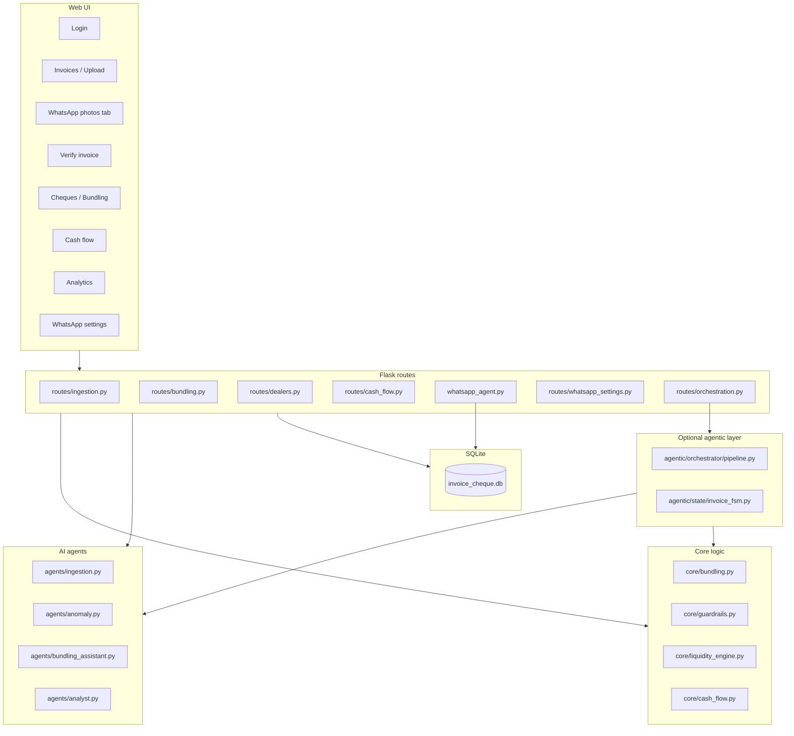
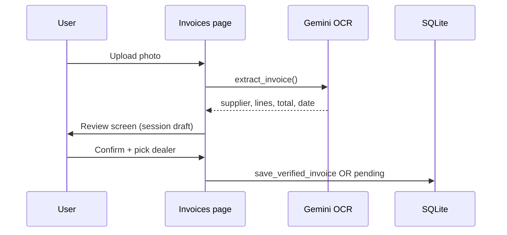
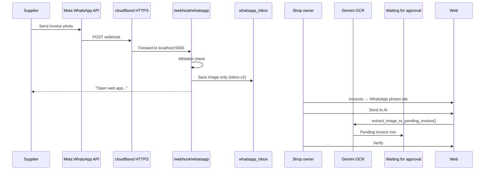
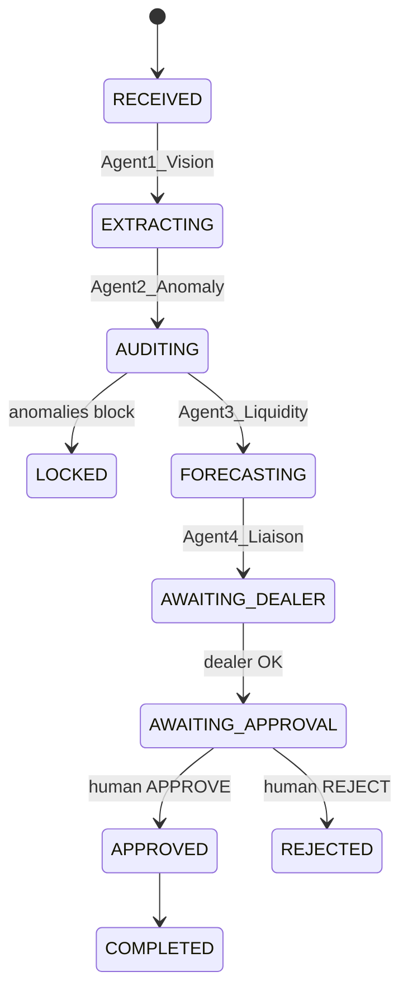
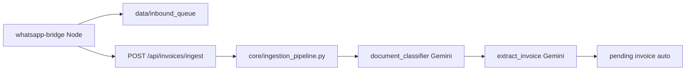

# Zenith Workflow Guide

This document explains how the **whole app** works today: the standard Flask web flows, WhatsApp intake, cheque bundling, and the optional **agentic** multi-agent layer in `agentic/`.

For database tables and relationships, see [database/DATABASE.md](../database/DATABASE.md). For agentic API details, see [agentic/README.md](../agentic/README.md).

---

## What Zenith does

Zenith (ChequeMate) helps Sri Lankan businesses:

1. **Receive** supplier invoice photos (web upload or WhatsApp)
2. **Extract** line items and totals with Gemini OCR
3. **Verify** data with a human before accepting the invoice
4. **Bundle** verified invoices into cheques under an LKR ceiling
5. **Track** when money must leave the bank (liquidity / cash flow)
6. **Print** cheques and review analytics

Everything persists in **SQLite** (`database/invoice_cheque.db`). The web UI runs on Flask at `http://127.0.0.1:5000`.

---

## App map (modules)



---

## Standard workflow (default — what most users see)

This is the **production path** when `USE_AGENTIC_ORCHESTRATOR=false` (default).

### 1. Login

| Step | Where |
|------|--------|
| User opens app | `GET /login` |
| Password check | `APP_PASSWORD` in `.env` or `user.password_hash` in DB |
| Session | `routes/auth.py`, `core/auth.py` |

### 2. Invoice intake (three ways)

#### A. Web upload



- **Upload:** `POST /upload` → `agents/ingestion.py` (Gemini vision)
- **Review:** `/review/<draft_id>` — edit fields, assign dealer
- **Verify:** `POST /review/<draft_id>/verify` → invoice marked verified

#### B. WhatsApp (Meta Cloud API — production)



| Stage | Behavior |
|-------|----------|
| **Receive** | `whatsapp_agent.py` — downloads media, saves to `whatsapp_inbox` (**no OCR yet**) |
| **Whitelist** | DB table `whatsapp_allowed_senders` (managed at **WhatsApp settings**) |
| **Manual OCR** | User clicks **Send to AI** → `POST /whatsapp-inbox/<id>/extract` |
| **Verify** | Same verify screen as web upload → `is_invoice_verified = 1` |

**Setup:** Run `python app.py` + `cloudflared tunnel --url http://127.0.0.1:5000`. Point Meta webhook to `https://<tunnel>/webhook/whatsapp`. See root [README.md](../README.md).

**Health check:** `GET /webhook/whatsapp/health` reports `intake_version: inbox-v2` and `gemini_on_whatsapp_receive: false`.

#### C. Manual invoice entry

No photo — user types invoice lines at **Invoices → Manual entry** (`/invoice/manual`).

### 3. Waiting for User Approval

After WhatsApp **Send to AI** (or some upload paths), invoices sit in the dashboard table **Waiting for User Approval**:

- DB: `invoices.is_invoice_verified = 0`
- Metadata: `pending_dealer_json` (OCR anomalies, WhatsApp sender, suggested dealer)
- Unknown supplier → linked to placeholder dealer **Pending Supplier** until user registers them on verify screen

### 4. Verify invoice

`GET/POST /invoice/<id>/verify`:

- Confirm invoice number, date, amount, line items
- Match or create dealer (+ bank details)
- Resolve anomaly warnings from `agents/anomaly.py`
- On confirm → `is_invoice_verified = 1` — invoice is ready for bundling

### 5. Cheque bundling

```mermaid
flowchart LR
    Verified[Verified invoices] --> Select[Select invoices + ceiling]
    Select --> Compute[Group into cheques]
    Compute --> Draft[bundle_drafts per dealer]
    Draft --> AI[Optional Bundling Assistant chat]
    AI --> Guard[guardrails.py checks]
    Guard --> Preview[Preview cheques]
    Preview --> Commit[POST /bundling/commit]
    Commit --> Cheque[cheque + allocations]
    Cheque --> Timetable[deposit_timetable]
```



| Piece | File / table |
|-------|----------------|
| UI workspace | `routes/bundling.py`, `templates/bundling.html` |
| Grouping math | `core/bundling.py` (Python — no LLM required) |
| AI chat assistant | `agents/bundling_assistant.py` (OpenAI + LangChain tools) |
| Safety limits | `core/guardrails.py` (ceiling, daily limits, holidays) |
| Draft state | `bundle_drafts` — not committed until user saves |
| Commit | Creates `cheque`, `cheque_invoice_allocation`, updates `invoices.cheque_id` |

**Drag-and-drop editor:** Move invoices between cheques on the dealer cheques page (`static/js/bundling.js`).

**Vector patterns (optional):** When `ENABLE_VECTOR_PATTERNS=true`, committed cheque history is embedded in ChromaDB to suggest bundling behavior per dealer — see [docs/Vector_Pattern_Engine.md](Vector_Pattern_Engine.md).

### 6. Cash flow

- **Route:** `/cash-flow`
- **Logic:** `core/cash_flow.py`, `core/liquidity_engine.py` — CBSL holidays, when to deposit, projected balance
- **Tables:** `deposit_timetable`, `bank_deposits`, `planned_deposits`, `user_bank_account`
- **No LLM** — pure Python/date math

### 7. Cheque printing

- **Route:** `routes/cheque_print.py`
- **Core:** `core/cheque_printer.py` — layout, calibration, PDF/print API

### 8. Analytics

- **Route:** `/analytics` → generate report
- **AI:** `agents/analyst.py` (OpenAI) — markdown report from committed cheque metrics
- **Cache:** `analyst_reports` table

### 9. Dealers (suppliers)

- CRUD at `/dealers/new`, `/dealers/<id>/details`
- Per-dealer invoice list, cheques tab, delivery dates, aging
- `routes/dealers.py`

---

## Agentic workflow (optional layer)

The `agentic/` package is a **separate orchestration layer** that runs a 4-agent pipeline with a finite-state machine (FSM) and PER loop (Plan → Execute → Review → retry). It **does not replace** the normal web app unless you explicitly enable it or call its API.

### When is agentic used?

| Trigger | `USE_AGENTIC_ORCHESTRATOR=false` (default) | `USE_AGENTIC_ORCHESTRATOR=true` |
|---------|--------------------------------------------|----------------------------------|
| Web upload / verify / bundling | Normal Flask routes | **Unchanged** — still normal routes |
| WhatsApp **photos** | Inbox only → manual Send to AI | **Same** — still inbox-v2, no auto OCR |
| WhatsApp **text** replies | `core/whatsapp_conversation.py` | `agentic/adapters/whatsapp_bridge.py` — dealer confirm, approval FSM |
| HTTP API | `POST /api/orchestrate` always available | Same |

**Flag:** `USE_AGENTIC_ORCHESTRATOR` in `.env` / `config.py`.

### The four agents



| Agent | Role | AI? | Implementation |
|-------|------|-----|----------------|
| **Agent 1 — Vision** | OCR invoice fields | **Gemini** | `agents/ingestion.py`, `core/whatsapp_intake.py` |
| **Agent 2 — Anomaly** | Pre-verify audit on every invoice | **SQLite rules** — math, discount, qty history, reorder, chat panel | `agents/anomaly.py`, `_agent2_audit_card.html` |
| **Agent 3 — Strategist** | Cheque splits, banks, float dates | **Gemini** JSON `proposed_cheques` | `agents/strategist.py` |
| **Agent 4 — Reviewer** | Explain strategy in plain language | **Gemini** — UI lang (`en`/`si`/`ta`), teacher tone | `agents/reviewer.py` |

**Guardrails** (Python, no LLM): `core/guardrails.py` — runs after Agent 3 before Agent 4.

### Agentic entry points

**Python:**

```python
from agentic import handle_event, get_session_trace
from agentic.contracts.events import EventType, InboundEvent

event = InboundEvent(
    event_type=EventType.INVOICE_IMAGE,
    session_id="+94771234567",
    payload={"image_path": "storage/invoices/abc.jpg", "lang": "en"},
    source="whatsapp",
)
actions = handle_event(event)  # list of OutboundAction
```

**HTTP:**

| Method | Path | Purpose |
|--------|------|---------|
| POST | `/api/orchestrate` | Send `InboundEvent` JSON |
| GET | `/api/sessions/<id>/trace` | Debug trace of agent steps |
| GET | `/api/agentic/health` | Health check |

**Event types** (`agentic/contracts/events.py`):

- `INVOICE_IMAGE` — run full pipeline from photo
- `DEALER_REPLY` — dealer text (name confirm, etc.)
- `APPROVAL_DECISION` — user APPROVE / REJECT on WhatsApp
- `OFFLINE_SYNC` — catch-up placeholder

**Outbound actions** returned to caller:

- `SHOW_UI` — show draft, anomalies, cheque plan in UI
- `SEND_MESSAGE` — text to send on WhatsApp
- `AWAIT_APPROVAL` — wait for human APPROVE/REJECT
- `ENQUEUE_RETRY` — transient failure, retry later

### Agentic vs standard path (important)

| Concern | Standard app | Agentic layer |
|---------|--------------|---------------|
| Where invoices are saved | `db/repositories.py` → `invoices` table | Same adapters; session memory in agentic repo |
| Human verify step | Required on web **Verify** screen | Can pause at `AWAITING_APPROVAL` on WhatsApp |
| Cheque commit | User in bundling UI | Not automatic — user still commits in web app |
| Production WhatsApp photos | **Inbox → Send to AI** (recommended) | Does not auto-run on webhook receive |

The agentic layer is best for **experiments, demos, WhatsApp text conversations, and `/api/orchestrate` integrations**. Day-to-day shop operation uses the **standard web + Meta inbox** flow above.

---

## Optional: Node.js WhatsApp bridge (dev)

Not required for Meta production. Useful for local testing without Meta credentials.



| Piece | Path |
|-------|------|
| Bridge | `whatsapp-bridge/` — `whatsapp-web.js`, QR login |
| Ingest API | `routes/whatsapp_settings.py` |
| Auth header | `X-Zenith-Bridge-Token` |
| Pipeline | Whitelist → classify → OCR → pending (**skips** web inbox step) |
| Dedup | `inbound_messages.wa_msg_id` |

**Difference from Meta path:** Bridge **auto-runs** OCR on ingest. Meta path waits for user **Send to AI**.

---

## AI providers (who calls what)

| Provider | Used for | Config | Main files |
|----------|----------|--------|------------|
| **Gemini** | Invoice OCR, Agent 3 strategist, Agent 4 reviewer | `GEMINI_API_KEY`, `GEMINI_VISION_MODEL`, `GEMINI_TEXT_MODEL` | `agents/ingestion.py`, `agents/strategist.py`, `agents/reviewer.py` |
| **OpenAI** | Bundling chat, analytics, guide widget, embeddings | `OPENAI_API_KEY`, `OPENAI_CHAT_MODEL`, `OPENAI_ANALYST_MODEL` | `agents/bundling_assistant.py`, `agents/analyst.py`, `agents/guide.py`, `core/vector_store.py` |
| **None (Python)** | Guardrails, liquidity dates, fallback `compute_bundles` | — | `core/bundling.py`, `core/guardrails.py`, `core/liquidity_engine.py` |

**Demo mode:** `USE_FAKE_AI=true` — mock OCR and chat with zero API usage.

**Bundling assistant mode:** `USE_BUNDLING_TOOL_AGENT=true` — LangChain tool-calling (default). `false` — legacy JSON `proposed_actions`.

---

## Database workflow states (quick reference)

| Area | State / column | Meaning |
|------|----------------|---------|
| **Invoice** | `is_invoice_verified = 0` | Pending human verify |
| **Invoice** | `is_invoice_verified = 1` | Ready for bundling |
| **Invoice** | `cheque_id` set | Assigned to a committed cheque |
| **WhatsApp inbox** | `whatsapp_inbox.status = pending` | Photo waiting for Send to AI |
| **WhatsApp inbox** | `status = extracted` | OCR done, linked to `invoice_id` |
| **Bundle workspace** | `bundle_drafts` | Uncommitted cheque groups per dealer |
| **Cheque** | `verification_status = 0` | Draft |
| **Cheque** | `verification_status = 1` | Committed |
| **Liquidity** | `deposit_timetable.status = pending` | Money not yet cleared from bank |
| **Bridge ingest** | `inbound_messages.pipeline_status` | `processed`, `failed`, `ignored_sender`, etc. |
| **Rejected photos** | `unprocessed_media_log` | Non-invoice images from bridge path |

Full schema: [database/DATABASE.md](../database/DATABASE.md).

---

## Configuration cheat sheet

| Variable | Effect |
|----------|--------|
| `APP_PASSWORD` | Web login |
| `GEMINI_API_KEY` | OCR + classifier |
| `OPENAI_API_KEY` | Bundling assistant, analytics, guide |
| `USE_FAKE_AI` | Demo mode — no real API calls |
| `WHATSAPP_PROVIDER` | `meta` (default) or `twilio` |
| `META_WHATSAPP_TOKEN`, `META_PHONE_NUMBER_ID`, `META_VERIFY_TOKEN` | Meta webhook |
| `WEBHOOK_PUBLIC_URL` | Tunnel URL for `scripts/probe_whatsapp_webhook.py` |
| `USE_AGENTIC_ORCHESTRATOR` | Route WhatsApp **text** through agentic FSM |
| `AGENT_CONDITIONAL_AI` | Gemini only when agent 2–3 triggers fire |
| `USE_BUNDLING_TOOL_AGENT` | LangChain bundling assistant |
| `ENABLE_VECTOR_PATTERNS` | ChromaDB dealer payment patterns |
| `WHATSAPP_BRIDGE_SECRET` | Optional Node bridge ingest only |

---

## Typical day for a shop owner

1. **Morning:** Flask + cloudflared running; Meta webhook connected.
2. **During day:** Suppliers WhatsApp invoice photos → appear under **WhatsApp photos**.
3. **When ready:** Open Invoices → **Send to AI** on each photo → **Verify** details.
4. **Weekly:** Go to **Cheques** → select dealer → tick invoices → **Group into cheques** → adjust with drag-and-drop or AI chat → **Commit**.
5. **Cash planning:** Check **Cash flow** for deposit dates and projected balance.
6. **Print:** Print cheques from committed bundles.
7. **Review:** **Analytics** report (optional).

---

## Related docs

- [README.md](../README.md) — setup and run instructions
- [database/DATABASE.md](../database/DATABASE.md) — full schema
- [agentic/README.md](../agentic/README.md) — agentic API
- [docs/Vector_Pattern_Engine.md](Vector_Pattern_Engine.md) — ChromaDB bundling patterns
- [whatsapp-bridge/README.md](../whatsapp-bridge/README.md) — optional Node bridge
